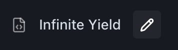

# 
Auto Execute Manager

  
Auto Execute Manager provides an intuitive interface for managing scripts that automatically execute when joining Roblox games.

## 
✨ Overview

Auto Execute Manager allows you to:

- Manage scripts that run automatically on game join
- Create and edit auto-execute scripts easily
- Organize your auto-execute collection
- Access Hydrogen's auto-execute directory quickly

## 
📝 Managing Scripts

### Creating a New Script

1. **Add Script**

    - Navigate to the left sidebar
    - Click the plus (+) button
    - A new script will appear in the sidebar

2. **Edit Content**
    - Click on the script in the sidebar
    - Edit the script content in the main editor
    - Changes are saved automatically

### Renaming Scripts

  

1. **Access Rename Mode**

    - Locate the pencil button in the script's topbar
    - Click to enter rename mode

2. **Apply Changes**
    - Edit the script name
    - Click the checkmark button to save
    - Or click the cross button to cancel

## 
🛠️ Top Bar Controls

Located in the top-right corner:

- **Folder Button**: Open Hydrogen's auto-execute scripts directory

## 
💡 Tips

- Keep your auto-execute scripts organized and properly named
- Test scripts individually before adding them to auto-execute
- Use descriptive names for easy identification

## 
⚠️ Important Notes

- Scripts will execute automatically when joining any Roblox game
- Changes to scripts take effect on the next game join
- Auto-executed scripts are stored in Hydrogen's designated directory
