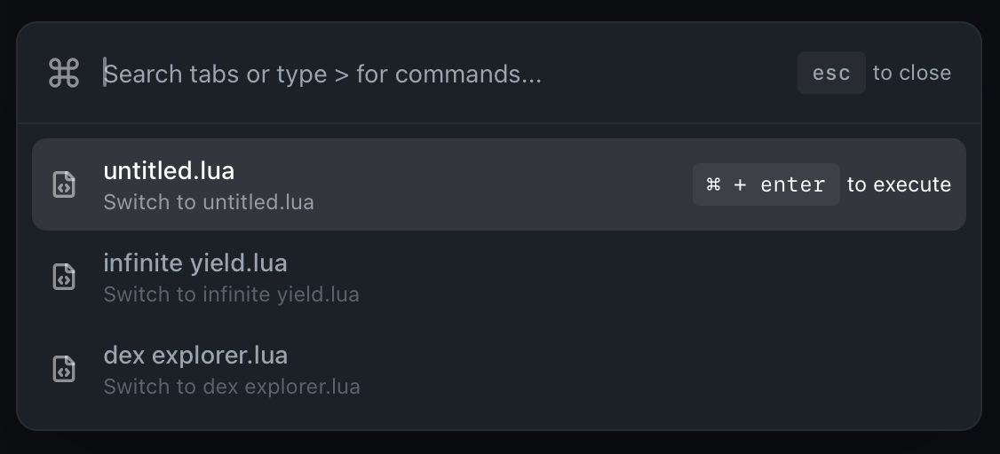

# 
Command Palette

  
Command Palette provides quick access to tabs and commands through a searchable interface, accessible via keyboard shortcuts.

  

## 
✨ Overview

Command Palette allows you to:

- Switch between tabs quickly
- Execute common actions via commands
- Search through tabs and commands
- Access features without using the mouse

## 
⌨️ Usage

1. **Open Command Palette**

    - Press `⌘ P` to open the palette
    - Type to search through tabs and commands
    - Use `>` or `/` prefix to search commands only

2. **Navigation**
    - Use arrow keys to navigate through results
    - Press `Enter` to select an item
    - Press `⌘ Enter` on tabs to execute them instead of switching
    - Press `Esc` to close the palette

## 
🛠️ Available Commands

### Editor Controls

- **New Tab**: Create a new editor tab
- **Toggle Zen Mode**: Enable/disable distraction-free mode
- **Toggle Console**: Show/hide the console
- **Toggle Console Mode**: Switch between docked and floating console

### Script Management

- **Execute Script**: Run the current tab's script
- **Open Roblox**: Launch Roblox application

### Fast Flags

- **Fast Flags**: Quick access to Fast Flags profiles
    - Use `>flags` or `>f` to list all profiles
    - Use `>flags [name]` to filter profiles
    - Use `>flags none` or `>flags clear` to disable all flags
