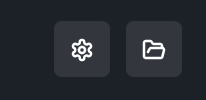

# 
Fast Flags Manager

  
Fast Flags Manager in Comet provides a powerful interface for managing Roblox Fast Flags through customizable profiles and configurations.

> [!WARNING]
> Some Fast Flags configurations may result in account bans in certain games. Use with caution and at your own risk.

## 
✨ Overview

Fast Flags Manager allows you to:

- Create and manage multiple Fast Flags profiles
- Switch between different configurations easily
- Fine-tune Roblox settings for optimal performance
- Choose between easy and advanced management modes
- Import and export profiles for backup or sharing

## 
📋 Profiles

  

### Creating a Profile

1. **Access Profile Creation**

    - Navigate to the left sidebar
    - Locate the plus (+) button at the top
    - Click to open the profile creation modal

2. **Set Up Profile**
    - Enter a descriptive name for your profile
    - Click "Save" to create the profile

### Managing Profiles

- **Activate Profile**

    - Hover over the desired profile
    - Click the checkmark button to "Set Active"
    - Active profile will be highlighted in white-light gray

- **Rename Profile**

    - Hover over a profile in the sidebar
    - Click the pencil (edit) icon that appears
    - Enter the new name in the modal
    - Click "Rename" to save changes

- **Delete Profile**

    - Hover over a profile in the sidebar
    - Click the trash icon that appears
    - Confirm deletion in the modal
    - Note: Active profiles require deactivation first

### Import/Export

Located in the top-right corner:

- **Export Profiles**: Save all profiles to a file for backup
- **Import Profiles**: Load profiles from a previously exported file

## 
⚙️ Management Modes

### Easy Mode

- Simplified interface for common settings
- Pre-configured inputs for default Fast Flags
- Recommended for beginners
- Quick access to essential optimizations

### Advanced Mode

- Full control over Fast Flags configuration
- Ability to add, edit, and delete flags
- Complete customization options
- Recommended for experienced users

## 
🛠️ Top Bar Controls

  

Located in the top-right corner:

- **Gear Button**: Switch between Easy/Advanced modes
- **Folder Button**: Open Fast Flags config file directory
- **Download Button**: Export profiles to file
- **Upload Button**: Import profiles from file

## 
💡 Tips

- Create separate profiles for different games
- Test configurations in less risky environments first
- Keep track of which flags work best for specific scenarios

## 
⚠️ Important Notes

- Certain configurations could trigger games anti-cheat systems
- Always research the impact of flags before using them
