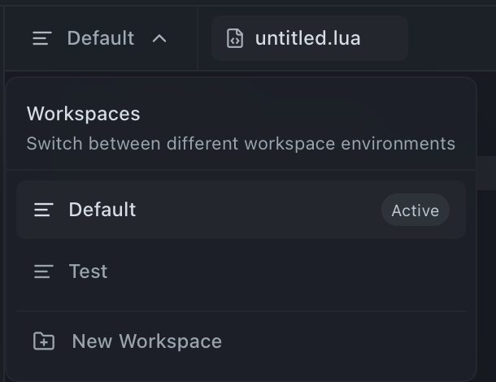

# 
Workspaces

  
Workspaces in Comet provide an efficient way to manage and organize your scripts through separate tab environments.

  

## 
✨ Overview

Workspaces allow you to:

- Create separate environments for different types of scripts
- Maintain multiple sets of tabs independently
- Better organize your development workflow
- Switch between different script collections easily

## 
🚀 Creating a New Workspace

Follow these steps to create and use a new workspace:

  

1. **Access Workspace Selector**

    - Look at the tabbar area
    - Find and click on the workspace selector dropdown

2. **Create Workspace**

    - Click the "New workspace" button
    - Enter your desired workspace name (max 24 characters)
    - Press Enter to confirm

3. **Switch to New Workspace**
    - Return to the workspace selector
    - Click on your newly created workspace
    - You're now in a fresh tab environment!

## 
⚙️ Managing Workspaces

### Renaming Workspaces

1. **Access Rename Mode**
    - Hover over a workspace in the selector dropdown
    - Click the pencil (edit) icon that appears
    - Enter the new name (max 24 characters)
    - Press Enter to save or Escape to cancel

### Deleting Workspaces

1. **Remove Workspace**
    - Hover over a workspace in the selector dropdown
    - Click the trash icon that appears
    - Confirm the deletion in the modal
    - Note: You cannot delete the active workspace

## 
💡 Tips

- Each workspace maintains its own separate set of tabs
- Use descriptive names for your workspaces (e.g., "Combat Scripts", "Farming Scripts")
- You can easily switch between workspaces using the selector
- Perfect for organizing scripts by category or project

## 
📝 Notes

- Workspaces are saved automatically
- Each workspace has its own independent tab state
- You can create as many workspaces as needed
- Switching workspaces preserves the state of your tabs
